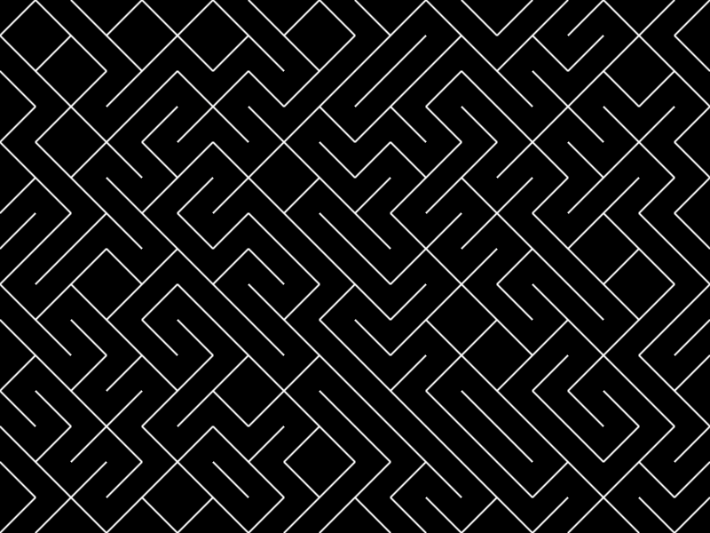

# Random Maze-like art

This repository is inspired by [TheCodingTrain Live Stream: JavaScript Hardware with Noopkat](https://youtu.be/UwX0ntmJ61A?t=393)
where she displays a random maze-like art on a canvas. I was unable to find the same project showcased in the video but it
belongs to [Middlebury - CS 1003](https://www.cs.middlebury.edu/~candrews/classes/genart/).

## Example

## TODO

- [ ] Add side panel with configuration options:
    - [ ] Number of rows
    - [ ] Number of columns
    - [ ] Maze size
    - [ ] Background color
    - [ ] Line color
    - [ ] Export as PNG
- [ ] Ability to switch wall direction on click
